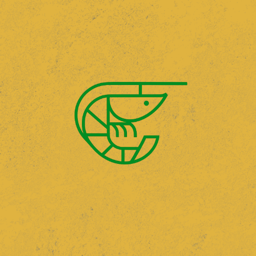

# SMAFEED-UF

<p align="center">
  
</p>

<p align="center">
  Aplikasi mobile untuk mengontrol dan memonitor sistem pakan udang otomatis.
</p>

---

## 📝 Daftar Isi

- [Tentang Proyek](#-tentang-proyek)
- [✨ Fitur Utama](#-fitur-utama)
- [🛠️ Tumpukan Teknologi](#️-tumpukan-teknologi)
- [🚀 Memulai](#-memulai)
  - [Prasyarat](#prasyarat)
  - [Instalasi](#instalasi)
- [📂 Struktur Proyek](#-struktur-proyek)
- [📜 Skrip yang Tersedia](#-skrip-yang-tersedia)
- [🤝 Kontribusi](#-kontribusi)
- [📄 Lisensi](#-lisensi)

---

## 📖 Tentang Proyek

**SMAFEED-UF** (Smart Feed Udang Farm) adalah aplikasi mobile yang dirancang untuk mengontrol dan memonitor sistem pakan udang otomatis. Aplikasi ini memungkinkan petambak udang untuk mengatur jadwal pemberian pakan, durasi penyebaran pakan, serta memantau kondisi vital tambak seperti tingkat pH air dan status perangkat keras secara real-time dari mana saja.

---

## ✨ Fitur Utama

- **Kontrol Pakan Otomatis**: Atur jadwal dan durasi pemberian pakan udang secara presisi.
- **Monitoring Real-time**: Pantau tingkat pH air dan status operasional perangkat dari jarak jauh.
- **Antarmuka Intuitif**: Desain yang mudah digunakan untuk mengelola semua aspek sistem pakan.
- **Lintas Platform**: Berjalan mulus di Android, iOS, dan Web dari satu basis kode.
- **Routing Berbasis File**: Navigasi yang sederhana dan kuat menggunakan `expo-router`.
- **Arsitektur Modern**: Didayai oleh Arsitektur Baru React Native untuk kinerja yang lebih cepat dan UI yang lebih responsif.

---

## 🛠️ Tumpukan Teknologi

- **React Native**: Kerangka kerja utama untuk membangun aplikasi.
- **Expo**: Platform untuk membuat aplikasi universal React.
- **Expo Router**: Sistem routing berbasis file untuk aplikasi React Native & Web.
- **JavaScript**: Bahasa pemrograman yang digunakan.

---

## 🚀 Memulai

Ikuti langkah-langkah ini untuk menjalankan salinan lokal dari proyek ini.

### Prasyarat

Pastikan Anda telah menginstal perangkat lunak berikut:
- Node.js (versi LTS direkomendasikan)
- Git
- Expo Go di perangkat seluler Anda (untuk pengujian)

Anda juga dapat menginstal Expo CLI secara global (opsional):
```bash
npm install -g expo-cli
```

### Instalasi

1.  **Clone repositori ini:**
    ```bash
    git clone https://github.com/username/repo-name.git
    cd smafeeduf-app
    ```

2.  **Instal dependensi proyek:**
    ```bash
    npm install
    # atau jika Anda menggunakan yarn
    # yarn install
    ```

3.  **Jalankan server pengembangan:**
    ```bash
    npx expo start
    ```

4.  Pindai kode QR yang muncul di terminal menggunakan aplikasi Expo Go di ponsel Anda, atau tekan `a` untuk Android emulator atau `i` untuk iOS simulator.

---

## 📂 Struktur Proyek

```
smafeeduf-app/
├── app/              # Semua rute dan layar (dikelola oleh Expo Router)
├── assets/           # Gambar, font, dan file statis lainnya
├── components/       # Komponen UI yang dapat digunakan kembali (disarankan)
└── app.json          # File konfigurasi utama untuk proyek Expo
```

---

## 📜 Skrip yang Tersedia

- `npx expo start`: Memulai server pengembangan Metro.
- `npx expo run:android`: Membangun dan menjalankan aplikasi pada emulator/perangkat Android.
- `npx expo run:ios`: Membangun dan menjalankan aplikasi pada simulator/perangkat iOS.
- `npx expo start --web`: Menjalankan aplikasi di browser web.

---

## 🤝 Kontribusi

Kontribusi sangat kami hargai! Jika Anda memiliki saran untuk membuat proyek ini lebih baik, silakan fork repositori ini dan buat pull request. Anda juga bisa membuka issue dengan tag "enhancement".

1.  Fork Proyek
2.  Buat Branch Fitur Anda (`git checkout -b feature/AmazingFeature`)
3.  Commit Perubahan Anda (`git commit -m 'Add some AmazingFeature'`)
4.  Push ke Branch (`git push origin feature/AmazingFeature`)
5.  Buka Pull Request

---

## 📄 Lisensi

Didistribusikan di bawah Lisensi MIT. Lihat `LICENSE.txt` untuk informasi lebih lanjut.

---

Dibuat oleh **makipak** (berdasarkan `package` di `app.json`).
